# Tektonology SPA

Next.js static site for [tektonology.com](https://tektonology.com) — a church/home maintenance asset tracker with 3D-printable solutions.

## Operations Data Model

All collection-level entities extend `Auditable` (`createdAt`, `updatedAt`, `deletedAt`).
Transactional entities carry an effective date separate from `createdAt` to support latent recording.

```mermaid
erDiagram
    Auditable {
        string createdAt "ISO 8601 — when recorded"
        string updatedAt "ISO 8601 — last modified"
        string deletedAt "ISO 8601 — soft delete"
    }

    Spool {
        number spoolId PK
        string brand
        string material
        string color
        string effective "when it occurred"
        number cost "fully-loaded"
        number weightG "starting grams"
        number remainingG
        number journalId FK
    }

    Printer {
        number printerId PK
        string brand
        string name
        string effective "when it occurred"
        number baseCost
        number taxes
        number shipping
        number cost "fully-loaded"
        number hoursUsed "cumulative"
        number journalId FK
    }

    Nozzle {
        number nozzleId PK
        string brand
        string nozzle "e.g. 0.4mm Stainless"
        string effective "when it occurred"
        number baseCost
        number taxes
        number shipping
        number cost "fully-loaded"
        number hoursUsed "cumulative"
        number journalId FK
    }

    Plate {
        number plateId PK
        string brand
        string plate "e.g. Textured PEI"
        string effective "when it occurred"
        number baseCost
        number taxes
        number shipping
        number cost "fully-loaded"
        number hoursUsed "cumulative"
        number journalId FK
    }

    PrintJob {
        string project
        PrintJobOutcome outcome "production|prototype|tooling|failed"
        number printerId FK
        number nozzleId FK
        number plateId FK
        number spoolId FK
        number usageG
        number hours "print duration"
        Component components "empty on failure"
        string effective "when it occurred"
        boolean processed
        number cost "usageG x rate"
        string processedAt "ISO 8601"
    }

    Component {
        number productId FK "optional for one-offs"
        string version "which version was printed"
        string stlUrl "STL file used"
        string part "e.g. Insert, Bushing"
        number quantity
    }

    Product {
        number productId PK
        string name "e.g. Kneeler Boot"
        string category
        string description
        ProductOrigin origin "original|third-party"
        string sourceUrl "third-party URL"
        string effective "when first created"
        Record printSettings "camelCase keys"
        string assemblyGuide "optional steps"
        ProductVersion versions "version history"
    }

    ProductVersion {
        string version "semver"
        string commit "GitHub SHA"
        string effective "when it occurred"
        string scadUrl "OpenSCAD source"
        ProductStl stls "STL files"
        string changelog
    }

    ProductStl {
        string label
        string url "path to STL"
        string color "hex color"
    }

    Inventory {
        number inventoryId PK
        string product "e.g. Compound Bonded Boot"
        string effective "when it occurred"
        InventoryComponent components "from print jobs"
        InventoryHardware hardware "optional fasteners etc"
        number quantity "total assembled"
        number remaining "after consumption"
    }

    InventoryComponent {
        string printJobId FK "MongoDB _id"
        string part "component part name"
        number quantity
    }

    InventoryHardware {
        number hardwareId FK
        string item
        number quantity
    }

    Project {
        number projectId PK
        string name "e.g. St Stanislaus Restoration"
        string client
        boolean proBono
        string effective "when it occurred"
        string status "active|completed|cancelled"
        ProjectItem items "inventory consumed"
        number journalId FK
    }

    ProjectItem {
        number inventoryId FK
        string product
        number quantity
    }

    Sale {
        number saleId PK
        string effective "when it occurred"
        string customer
        SaleItem items "inventory sold"
        number revenue
        number journalId FK
    }

    SaleItem {
        number inventoryId FK
        string product
        number quantity
        number unitPrice
        number amount "qty x unit price"
    }

    Account {
        number number PK "chart-of-accounts"
        string name
        AccountType type "asset|liability|equity|revenue|cogs|expense"
        number balance
    }

    JournalEntry {
        number transactionId PK
        string effective "when it occurred"
        string description
    }

    JournalLine {
        number accountNumber FK
        string accountName
        number debit "null if credit"
        number credit "null if debit"
    }

    Hardware {
        number hardwareId PK
        string supplier
        string supplierId
        string item
        string dimensions
        string material
        string effective "when it occurred"
        number baseCost
        number taxes
        number shipping
        number cost "fully-loaded"
        number quantity
        number remaining
        number journalId FK
    }

    Printer ||--o{ PrintJob : "runs on"
    Nozzle ||--o{ PrintJob : "prints with"
    Plate ||--o{ PrintJob : "builds on"
    Spool ||--o{ PrintJob : "tracks usage"
    Product ||--o{ Component : "designed as"
    Product ||--|{ ProductVersion : "versioned as"
    ProductVersion ||--|{ ProductStl : "includes files"
    PrintJob ||--|{ Component : "produces"
    PrintJob ||--o{ InventoryComponent : "supplies parts"
    Inventory ||--|{ InventoryComponent : "assembled from"
    Hardware ||--o{ InventoryHardware : "used in"
    Inventory ||--o{ InventoryHardware : "optionally includes"
    Inventory ||--o{ ProjectItem : "consumed by"
    Inventory ||--o{ SaleItem : "sold as"
    Project ||--|{ ProjectItem : "consumes"
    Sale ||--|{ SaleItem : "contains"
    JournalEntry ||--o{ Spool : "proves COGS"
    JournalEntry ||--o{ Nozzle : "proves purchase"
    JournalEntry ||--o{ Plate : "proves purchase"
    JournalEntry ||--o{ Printer : "proves purchase"
    JournalEntry ||--o{ Hardware : "proves purchase"
    JournalEntry ||--o{ Project : "records cost"
    JournalEntry ||--o{ Sale : "records revenue"
    Account ||--o{ JournalLine : "debited/credited"
    JournalEntry ||--|{ JournalLine : "contains lines"
```



### Lifecycle

1. **Print** — Printing agent detects completion via MQTT, writes a `PrintJob` with printer/nozzle/plate/spool refs and `components[]` produced (phase 1: `processed: false`)
2. **Cost** — Accounting agent calculates filament cost, accumulates hours on printer/nozzle/plate, creates a balanced `JournalEntry`, marks job `processed: true`
3. **Inventory** — Components from print jobs + hardware are assembled into `Inventory` items (finished goods)
4. **Consume** — `Project` (custom orders, restorations, pro-bono) or `Sale` reduces inventory, each linked to a `JournalEntry` for COGS/revenue recognition
5. **Approve** — Print proxy (optional) intercepts jobs for approval before they reach the printer

## Development

```bash
npm run dev
```

Static export only (`output: "export"`) — no server-side runtime. Product and batch data lives in `data/` as JSON, loaded at build time via `readFileSync`.
